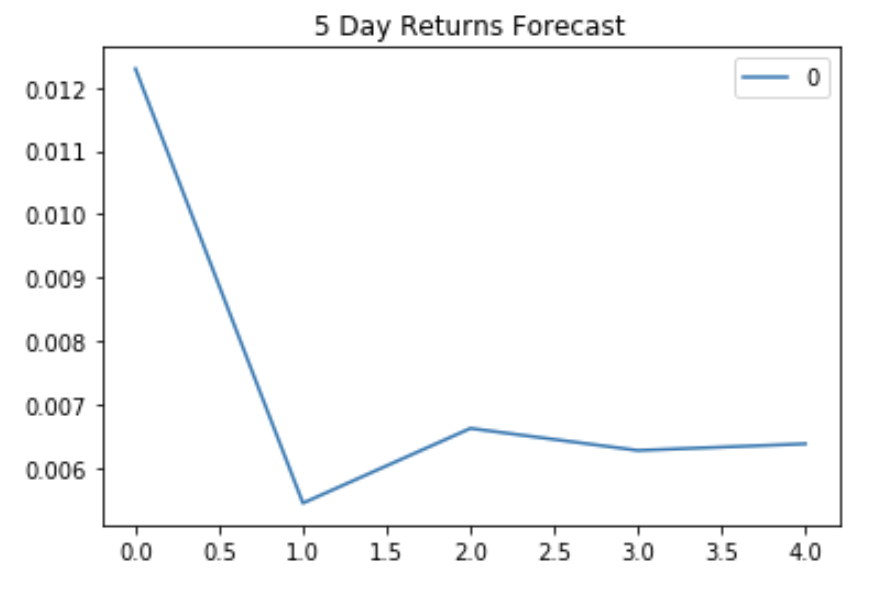
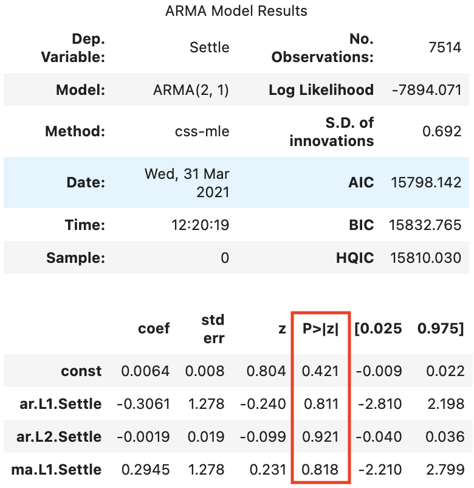
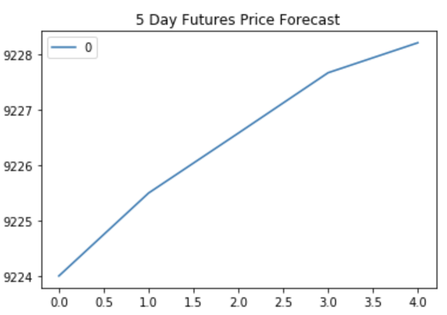
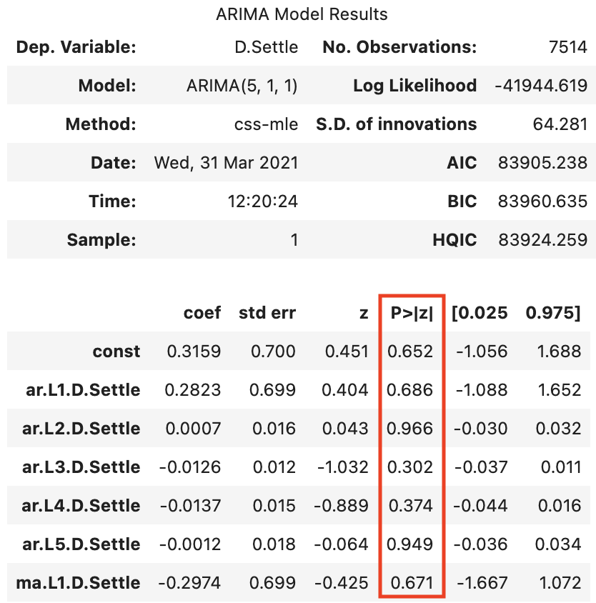
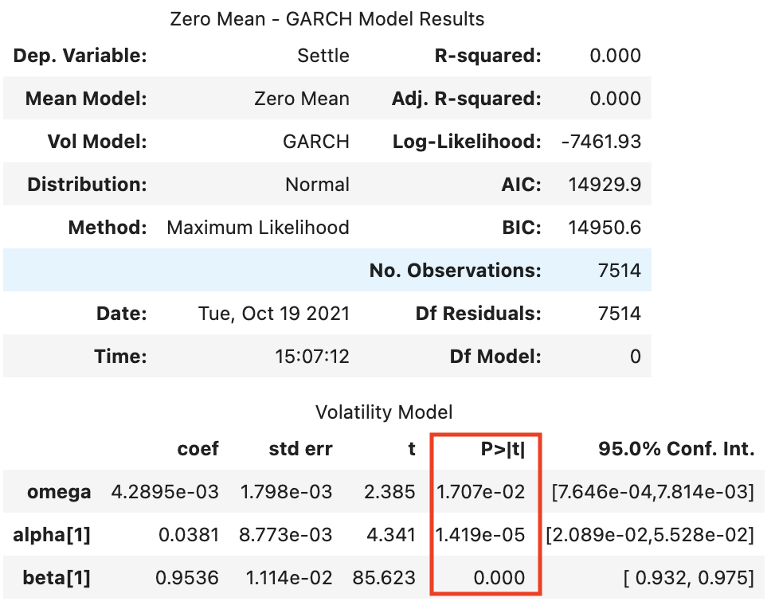
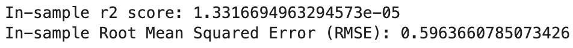
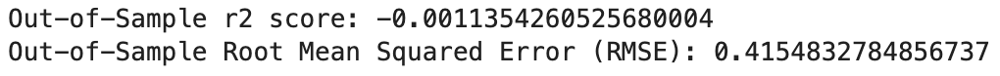
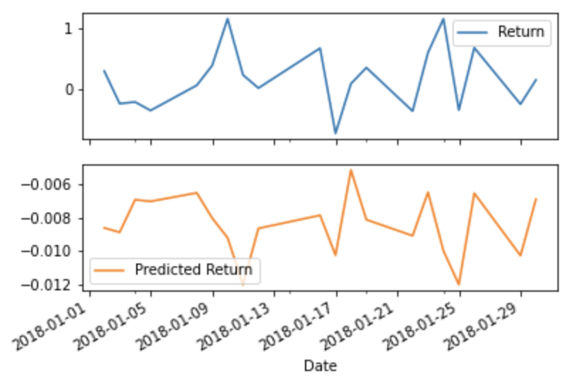

# A Yen for the Future

The included notebooks applies time series analysis and modeling in order to predict future movements in the value of the Japanese yen versus the U.S. dollar. The time_series_analysis notebook loads historical Dollar-Yen exchange rate futures data and uses the Hodrick-Prescott Filter as well as ARMA, ARIMA and GARCH models to determine whether there is any predictable behavior. The regression_analysis notebook builds a Scikit-Learn linear regression model to predict Yen future returns with lagged Yen future returns and categorical calendar seasonal effects.

---

## Technologies

Language: Python3, Pandas 

Imports: pandas, numpy, pathlib, matplotlib, statsmodels.api, statsmodels.tsa.arima_model, arch, sklearn.linear_model, sklearn.metrics 

External Resources: yen.csv

Developed with JupyterLab

---

## Installation

JupyterLab - [Install JupyterLab](https://jupyterlab.readthedocs.io/en/stable/getting_started/installation.html)

---

## Examples

- An ARMA model is used to predict Yen returns over a five day period and the results are visualized

- Based on the p-values of the lags, an ARMA is not a good fit for this data because all values are greater than 0.05, meaning there is no statistically relevant data present

- An ARIMA model is used to predict the settle price of Yen over a five day period and the results are visualized

- The model predicts that Yen will rise by 4 over the next 5 days. However, since all p-values are greater than 0.05 we know that no statistically relevant data is present and the model is not a good fit

- A GARCH model is used to predict volatility for Yen over a five day period and the results are visualized

- The GARCH model predicts that the risk of yen is expected to increase, and based on the p-values the model does include statistically significant data and is therefore a good fit and accurate predictor. To sum up, I can't be sure that the price of yen will go up but I am relatively sure the risk will go up

- Finally a linear regression model is used to predict Yen future returns.  A train test split is used to check to train our model and check the accuracy of the predictions which can be measured using the Root Mean Squared Error (RMSE) and the r2 score

-  While the both rsme's would both be considered high, the in-sample rmse is higher than the out-of-sample rmse which indicates that our model is overfit. Furthermore, the negative out-of-sample and very small in-sample r2 scores also tells us that this model is not a good fit for the data. Maybe we are using too much data or not the right data, maybe it's a bit of both, maybe a different model would be better suited for this data, we would need to manipulate the data different ways and rerun multiple models to narrow down the problem. Either way the model cannot tell what is statistically significant and therefore cannot make a accurate prediction.

---

## Contributors

Drew Disbrow Marnell: dldmarnell@gmail.com

---

## License

MIT License
Copyright (c) 2021 Drew Disbrow Marnell
